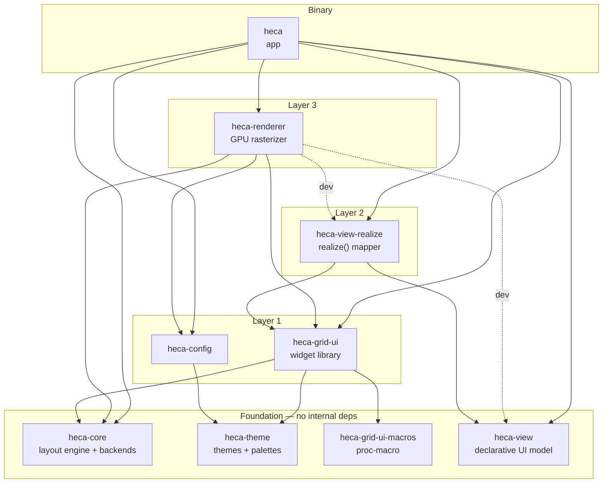
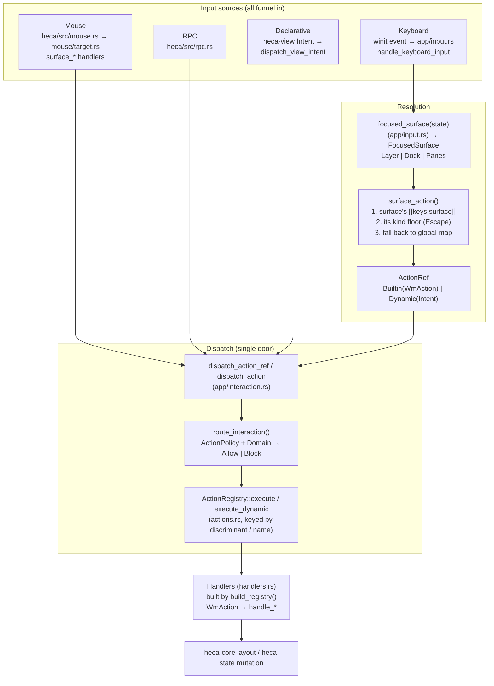

# heca — Architecture & Crate Map

> How the workspace crates are linked, and how each crate is internally structured.
> Generated from the workspace `Cargo.toml` and each crate's `src/` tree.

The workspace has **9 crates**. Four are foundation crates with no internal
dependencies; the rest build on them in clean layers, culminating in the `heca`
app binary.

> Note: the top-level `src/` directory is the **mdBook source** (`book/` is its
> built output) — it is not a crate and is excluded from this map.

## Crate dependency graph

Dashed edges are **dev-dependencies only** (used by `heca-renderer`'s `showcase`
example, not by the library or the app binary).

## Crate overview

| Crate | Role | Internal deps |
|---|---|---|
| `heca-core` | Layout engine (NIRI scrolling columns) + terminal/PTY backends | — (leaf) |
| `heca-theme` | Theme types + bundled palettes | — (leaf) |
| `heca-grid-ui-macros` | Proc-macro (`prop`/`props`/`PropName`) | — (leaf) |
| `heca-view` | Dependency-free declarative UI model (`ViewNode`/`Intent`) | — (leaf) |
| `heca-config` | Config loading (settings / keys / appearance / programs) | `heca-theme` |
| `heca-grid-ui` | GPU-free, signal-driven widget library | `heca-core`, `heca-theme`, `heca-grid-ui-macros` |
| `heca-view-realize` | `ViewNode` → live `heca-grid-ui` components | `heca-view`, `heca-grid-ui` |
| `heca-renderer` | `wgpu` / `cosmic-text` GPU rasterizer | `heca-core`, `heca-config`, `heca-grid-ui` |
| `heca` | App binary (event loop, actions, chrome, RPC) | `heca-core`, `heca-renderer`, `heca-config`, `heca-grid-ui`, `heca-view`, `heca-view-realize` |

## Per-crate internal structure

### `heca-core` (leaf)
- `backend/` — `PaneBackend` trait; `terminal/` (`engine`, `osc`, `process`,
  `pty`), `fake`, `snapshot`
- `layout/` — `types`, `animation`, `column`, `scrolling`, `session`,
  `view_offset`, `workspace`
- `runtime.rs`

### `heca-theme` (leaf)
- `color` — `Color`
- `loader` — `load_theme` / `available_themes` / `config_dir`
- `theme` — `Theme`, `FrameStyle`, `GlowLevel`, `Intensity`, `Shadow`

### `heca-grid-ui-macros` (leaf)
- single `lib.rs` — derives for `prop` / `props` / `PropName`

### `heca-view` (leaf)
- `lib` — `ViewNode` / `WidgetKind` / `PropValue` / `Intent` (deliberately
  serde-only, so plugins can describe UI without pulling in the renderer)
- `build` — builder helpers

### `heca-config`
- `appearance`, `color`, `confirm`, `font`, `keys`, `loader`, `programs`,
  `settings`, `theme` — re-exports `ConfigError`

### `heca-grid-ui`
Core modules:
- `component` (`Base`/`Component`), `layout` (`LayoutEngine`), `scene`
  (`DrawCommand`/`Scene`), `style`, `reactive`
- `event` / `pointer` / `focus` / `hint` / `nav` / `keymap` (DOM-shaped event
  model)
- `action` / `menu` / `search` / `drag/` / `effects` / `builders`
  (`ComponentExt`/`LayoutExt`/`Parent`/`StyleExt`)
- re-exports `heca_core::layout::*` and `heca_grid_ui_macros::*`

`widgets/` — ~55 generic widgets: `flex`, `surface`, `card`, `card_grid`,
`button`, `icon_button`, `icon`, `nf_icon`, `label`, `input`, `row`, `item`,
`item_group`, `select`, `choice`, `tabs`, `toggle`, `checkbox`, `overlay`,
`dialog`, `command_palette`, `context_menu`, `tooltip`, `toast`/`toast_stack`,
`badge`/`badge_button`, `tag`, `status_dot`, `separator`, `spinner`, `alert`,
`progress`, `gauge`, `grid`, `scroll_region`, `scroll_bar`, `dock_frame`,
`chrome_region`, `key_hint`/`key_hint_group`, `marker_group`, `rail_cell`,
`panel`, `pane`, `visibility`.

### `heca-view-realize`
- single `lib.rs` — `realize(&ViewNode) -> Box<dyn Component>`, one arm per
  `WidgetKind`. This is the half of the declarative path that needs the widget
  library, which is why it lives here and not in `heca-view`.

### `heca-renderer`
- `primitive`, `text`, `atlas`, `font`, `scene`, `image`, `gradient`,
  `background`, `backdrop`, `blur`, `clip`, `composite`, `grid`, `terminal`,
  `input` (shared `winit` key adapter used by both the app and the showcase)

### `heca` (binary)
- `main.rs` + `app_state`, `actions`, `handlers`, `input`, `keymap`, `rpc`,
  `host`, `search_state`, `shortcut`
- `app/` — `registry`, `interaction` (Allow/Block policy), `focus`, `keyboard`,
  `events`, `mutations`, `pane_ops`, `selection`/`selection_model`, `render`,
  `lifecycle`, `startup`, `conflicts`, `keys_show`, `git_monitor`,
  `process_monitor`, `terminal_host`/`terminal_metrics`/`terminal_render`,
  `backend_factory`/`backend_store`
- `chrome/` — `mod` (chrome host), `state`, `signals`, `theme`, `overlay`,
  `layers`, `palette`, `pane_header`, `hint`, `focus`, `contribution`, `drag`,
  `events`, `context_menu`, `host`; plus `expose/` (`pane_card` → `column_card`
  → `workspace_row` → `expose_grid` + `model` + `testing`) and `pane/`
  (`shell` + `model` + `testing`)
- `mouse/` — `target`, `hit_test`, `interactive`, `drag`, `release`, `render`,
  `resize`, `surface_left`, `tests`
- `providers/` — `actions`; `workspaces/` (`model`, `dock_view`, `column_group`,
  `workspace_frame`, `pane_row`, `seams`, `testing`)
- `components/` — shared app components

## Dependency rules worth remembering

- **`heca` → `heca-grid-ui` is the only allowed direction.** A widget library
  constructor must never take a `ViewNode` (that lives in `heca-view`, above the
  library). `realize()` is the single bridge from declarative model to widgets.
- **`heca-view` is dependency-free** on purpose — a plugin describes UI by
  depending on it alone, never on `heca-grid-ui` or `heca-renderer`.
- **`taffy` (in `heca-grid-ui`) is component-internal layout only** — it never
  positions panes/columns. The NIRI scrolling engine in `heca-core` is the single
  source of truth for window layout.

---

## Input → Action → Registry data flow

Every user-initiated change to WM state funnels through **one door**. Keyboard,
mouse, RPC, and declarative (`ViewNode`/`Intent`) sources all resolve to an
`ActionRef` and then pass through `route_interaction` → `registry.execute`. A
handler never calls WM mutation directly except via `registry.execute` (registry
bypasses are bugs).

Key facts (from the code):

- **`InputMode` drives keyboard** (`app/input.rs`): `Normal`, `Prefix` (tmux-style
  `ctrl+b` then key), `Mode{name}`, plus picker modes (`PaneSelect`, `PaneSwap`,
  `PaneTake`, `HintPick`, `WorkspacePick`, `ColumnPick`, `DockPick`, `Selection`,
  `Search`, `Chord`). Pickers resolve a letter to a `WmAction` and dispatch it.
- **A key acts on the surface in front of you** (`surface_action`, `app/input.rs`):
  nearest declaration wins — the focused surface's own `[[keys.surface]]` entry, then
  the floor its kind is guaranteed (`Layer` → `Escape` closes the layer; `Focus` →
  `Escape` releases the dock), then the global `[keys]` map. The panes declare
  nothing and have **no floor**, so unclaimed keys reach the program in the pane
  (vim keeps `Escape`).
- **`ActionRef` has two shapes**: `Builtin(WmAction)` (resolved at load via
  `build_action`/`action_from_name`) or `Dynamic(Intent)` (a name no built-in owns yet
  — e.g. a provider/plugin action resolved at press time). `register_dynamic`
  (`actions.rs`) wires name-keyed handlers + metadata into the one `ActionCatalog`.
- **Policy is separate from priority** (`app/interaction.rs`): `action_policy()`
  returns one of 7 `ActionPolicy` variants (Global / AlwaysAllowed / TiledOnly /
  FocusedPaneLocal / WorkspaceLevel / SourceDependent / ContainerFocused), checked
  against the computed `Domain` (Tiled / Floating / Container / Overlay). The match is
  exhaustive — adding a `WmAction` variant won't compile until it is classified.
- **`build_registry` (`app/registry.rs`)** registers every variant → its `handle_*`
  handler. Parameterized variants share one handler (it destructures the action).
- **Config is the single source of bindings**: `build_keymaps` (`app/registry.rs`)
  merges `keybindings.default.toml` + user `keybindings.toml` (deep-merge, arrays
  replaced wholesale), tracks conflicts, builds the reverse `BindingIndex`, and
  re-asserts the `Escape` floor on `focus`/`layer` modes.

## Chrome surface tree

Chrome is a **tree**, not a flat list. Paint order = pre-order over the tree =
lexicographic z-path. The model and the universal KeyHint resolver live in
`docs/surface-compositor.md`; the regions + mounted providers are owned by
`ChromeHost` (`chrome/host.rs`); the per-frame rendering is in `chrome/`
(`mod`, `overlay`, `layers`, `pane`/`expose`, `pane_header`, `palette`, `hint`).

```mermaid
flowchart TD
    root["root (LayerStack / SurfaceTree)"] --> bg["background  z0\nblurred gradient, passive, no targets"]
    root --> panes["panes container  (heca.panes surface)\ntiled panes; zoom = later sibling, not a level"]
    root --> sbL["left sidebar region  RegionId::LeftSidebar"]
    root --> sbR["right sidebar region  RegionId::RightSidebar"]
    root --> top["top bar region  RegionId::TopBar"]
    root --> bot["bottom bar region  RegionId::BottomBar"]
    root --> fl["floating panes  (base, above tiled)"]
    root --> exp["exposé  (context surface; sets current_index)"]
    exp --> cm["context menu  (modal child of opener)"]
    exp --> dlg["confirm / dialog  OverlayHost::open_modal  (Modal band)"]

    classDef base fill:#1b2b3a,stroke:#3a6ea5;
    classDef ctx fill:#3a1b2b,stroke:#a53a6e;
    class panes,sbL,sbR,top,bot,fl base;
    class exp,cm,dlg ctx;
```

Paint / interaction order (pre-order):
`bg < panes < sidebarL < sidebarR < top < bottom < floats < exposé < (context menu | dialog)`.

Composition rules (see `docs/surface-compositor.md`):

- **z is tree position — never a stored number.** A surface mounts as a child of its
  opener; `current_index` (active context) moves only on context surfaces (exposé /
  modal), never on zoom/scroll/DockView selection.
- **Occlusion is geometric**, decided by draw order + each surface's real laid-out
  bounds (its `occluder`) — not by a coarse level. A higher-z surface with an
  occluder covering a lower button hides it.
- **Buttons never declare a layer**; they inherit it from the surface they are
  mounted in, and get a `KeyHint` target automatically through `.on_hint` / the
  `ViewNode` `hint` event.
- **Regions host providers, not panes of chrome.** Each `RegionId` holds an ordered
  `Vec<MountedContribution>` (one per seated `Provider`), in the order they were added with
  `regions("sidebar.left").append(..)` / `.prepend(..)`. A dock that must sit elsewhere says
  `.order(..)` on the body it builds; how big it is, `.flex(n)` on the same body.
  A provider's **DockView selector** (`active_dock_view`) shows exactly one provider
  at a time (mutually exclusive — a selector, not a stack). Within a provider the
  tree is built from `heca-grid-ui` widgets; overlays/modals it opens are compositor
  children of the region.
- **Within-pane chrome** is composed, not painted: `pane_header` (config-driven
  `title_segments` + `title_actions` → `PaneAction` buttons, each tied to a
  `WmAction` with an auto-derived tooltip + `prefix+/` hint) and the `expose` tree
  (`expose_grid → workspace_row → column_card → pane_card`) — all built from
  `heca-grid-ui` widgets, never hand-drawn in `paint`.
- **Overlays/modals** are realized either from native `heca-grid-ui` trees or from a
  `heca-view` `ViewNode` (through `heca-view-realize`), so plugin-described layers
  are painted, input-routed, and hintable for free (`docs/surface-compositor.md` §9).
